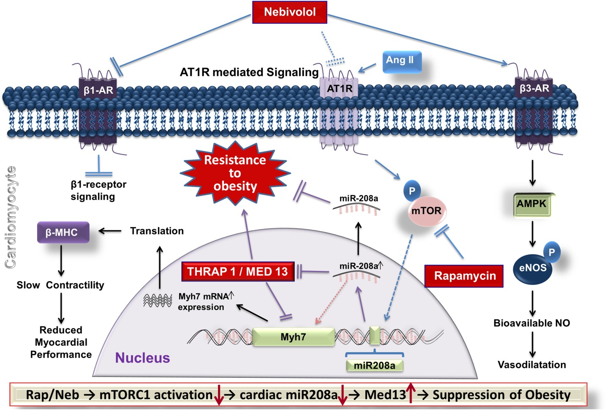

  

<b>ABSTRACT:</b>
Objective Resistance to obesity is observed in rodents and humans treated with rapamycin (Rap) or nebivolol (Neb). Because cardiac miR-208a promotes obesity, this study tested whether the modes of actions of Rap and Neb involve inhibition of miR-208a. Methods Mouse cardiomyocyte HL-1 cells and Zucker obese (ZO) rats were used to investigate regulation of cardiac miR-208a. Results Angiotensin II (Ang II) increased miR-208a expression in HL-1 cells. Pretreatment with an AT1 receptor (AT1R) antagonist, losartan (1 μM), antagonized this effect, whereas a phospholipase C inhibitor, U73122 (10 μM), and an NADPH oxidase inhibitor, apocynin (0.5 mM), did not. Ang II-induced increase in miR-208a was suppressed by Rap (10 nM), an inhibitor of nutrient sensor kinase mTORC1, and Neb (1 μM), a 3rd generation β-blocker that suppressed bioavailable AT1R binding of 125I-Ang II. Thus, suppression of AT1R expression by Neb, inhibition of AT1R activation by losartan, and inhibition of AT1R-induced activation of mTORC1 by Rap attenuated the Ang II-induced increase in miR-208a. In ZO rats, Rap treatment (750 μg kg−1 day−1; 12 weeks) reduced obesity despite similar food intake, suppressed cardiac miR-208a, and increased cardiac MED13, a suppresser of obesity. Conclusions Rap and Neb suppressed cardiac miR-208a. Suppression of miR-208a and increase in MED13 correlated with attenuated weight gain despite leptin resistance.

[Download paper here](https://onlinelibrary.wiley.com/doi/abs/10.1002/oby.21227)