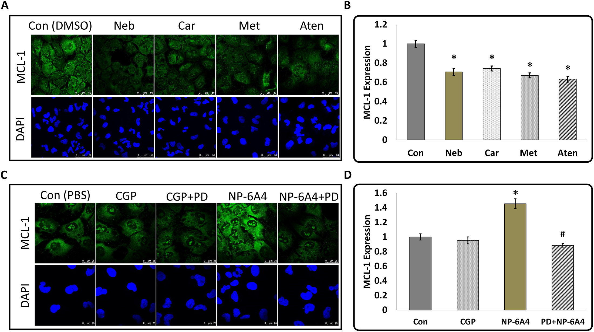

  

<b>ABSTRACT:</b>
In order to determine differences in cardiovascular cell response during nutrient stress to different cardiovascular protective drugs, we investigated cell responses of serum starved mouse cardiomyocyte HL-1 cells and primary cultures of human coronary artery vascular smooth muscles (hCAVSMCs) to treatment with β-blockers (atenolol, metoprolol, carvedilol, nebivolol, 3μM each), AT1R blocker losartan (1μM) and AT2R agonists (CGP42112A and novel agonist NP-6A4, 300nM each). Treatment with nebivolol, carvedilol, metoprolol and atenolol suppressed Cell Index (CI) of serum-starved HL-1 cells (≤17%, ≤8%, ≤15% and ≤15% respectively) as measured by the Xcelligence Real-Time Cell Analyzer (RTCA). Conversely, CI was increased by Ang II (≥9.6%), CGP42112A (≥14%), and NP-6A4 (≥25%) respectively and this effect was blocked by AT2R antagonist PD123319, but not by AT1R antagonist losartan. Thus, the CI signature for each drug could be unique. MTS cell proliferation assay showed that NP-6A4, but not other drugs, increased viability (≥20%) of HL-1 and hCAVSMCs. Wheat Germ Agglutinin (WGA) staining showed that nebivolol was most effective in reducing cell sizes of HL-1 and hCAVSMCs. Myeloid Cell Leukemia 1 (MCL-1) is a protein critical for cardiovascular cell survival and implicated in cell adhesion. β-blockers significantly suppressed and NP-6A4 increased MCL-1 expression in HL-1 and hCAVSMCs as determined by immunofluorescence. Thus, reduction in cell size and/or MCL-1 expression might underlie β-blocker-induced reduction in CI of HL-1. Conversely, increase in cell viability and MCL-1 expression by NP-6A4 through AT2R could have resulted in NP-6A4 mediated increase in CI of HL-1. These data show for the first time that activation of the AT2R-MCL-1 axis by NP-6A4 in nutrient-stressed mouse and human cardiovascular cells (mouse HL-1 cells and primary cultures of hCAVSMCs) might underlie improved survival of cells treated by NP-6A4 compared to other drugs tested in this study.

[Download paper here](https://journals.plos.org/plosone/article?id=10.1371/journal.pone.0144824)