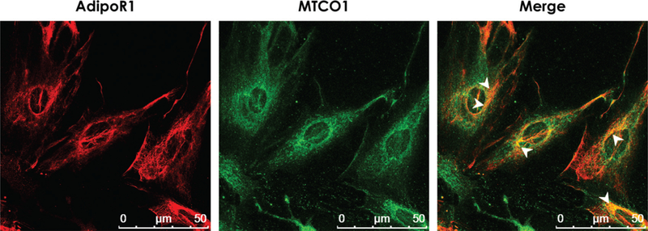

  

<b>ABSTRACT:</b>
Both circulating adiponectin (APN) and cardiac APN exert cardioprotective effects and improve insulin sensitivity and mitochondrial function. Low circulating APN serves as a biomarker for cardiovascular risk. Ablation of adiponectin receptor 1 (AdipoRl) causes myocardial mitochondrial dysfunction. Although high salt intake is a contributor to cardiovascular disease, how it modulates the expression of APN or AdipoRl in cardiomyocytes is not known. We report that APN mRNA expression was attenuated in a dose-dependent manner in mouse cardiomyocyte cell line HL-1 exposed to salt concentrations ranging from 0.75% to 1.5% for 12 h. High-salt exposure (0.88% and 1.25% for 12 h) also suppressed APN and AdipoRl protein expression significantly in rat cardiac muscle H9c2 cells. Co-immunostaining for AdipoR1 and mitochondrial complex 1 indicated that AdipoR1 may be co-localized with mitochondria. These data show for the first time that high salt is an important suppressor of cardiovascular protective APN and AdipoR1.

[Download paper here](https://www.ncbi.nlm.nih.gov/pmc/articles/PMC6372100/)