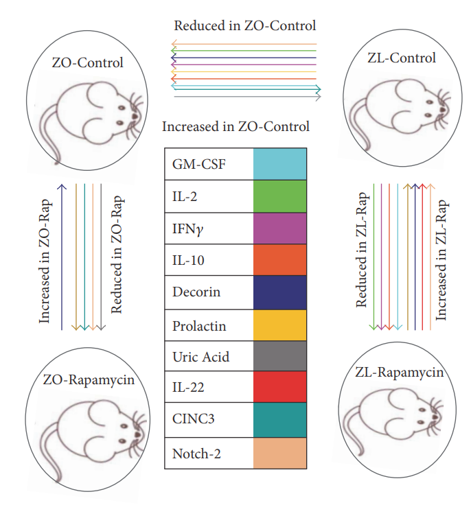

  

<b>ABSTRACT:</b>
Diabetes is comorbid with cardiovascular disease and impaired immunity. Rapamycin improves cardiac functions and extends lifespan by inhibiting the mechanistic target of rapamycin complex 1 (mTORC1). However, in diabetic murine models, Rapamycin elevates hyperglycemia and reduces longevity. Since Rapamycin is an immunosuppressant, we examined whether Rapamycin (750 μg/kg/day) modulates intracardiac cytokines, which affect the cardiac immune response, and cardiac function in male lean (ZL) and diabetic obese Zucker (ZO) rats. Rapamycin suppressed levels of fasting triglycerides, insulin, and uric acid in ZO but increased glucose. Although Rapamycin improved multiple diastolic parameters (E/E′, E′/A′, E/Vp) initially, these improvements were reversed or absent in ZO at the end of treatment, despite suppression of cardiac fibrosis and phosphoSer473Akt. Intracardiac cytokine protein profiling and Ingenuity® Pathway Analysis indicated suppression of intracardiac immune defense in ZO, in response to Rapamycin treatment in both ZO and ZL. Rapamycin increased fibrosis in ZL without increasing phosphoSer473Akt and differentially modulated anti-fibrotic IL-10, IFNγ, and GM-CSF in ZL and ZO. Therefore, fundamental difference in intracardiac host defense between diabetic ZO and healthy ZL, combined with differential regulation of intracardiac cytokines by Rapamycin in ZO and ZL hearts, underlies differential cardiac outcomes of Rapamycin treatment in health and diabetes.

[Download paper here](https://www.hindawi.com/journals/omcl/2017/5724046/)