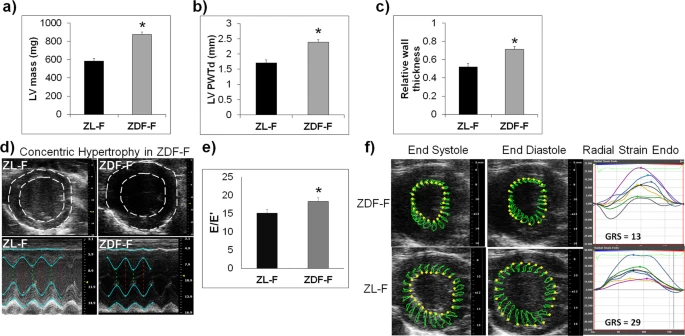

  

<b>ABSTRACT:</b>
Population studies have shown that compared to diabetic men, diabetic women are at a higher risk of cardiovascular disease. However, the mechanisms underlying this gender disparity are unclear. Our studies in young murine models of type 2 diabetes mellitus (T2DM) and cardiovascular disease show that diabetic male rats develop increased cardiac fibrosis and suppression of intracardiac anti-fibrotic cytokines, while premenopausal diabetic female rats do not. This protection from cardiac fibrosis in female rats can be an estrogen-related effect. However, diabetic female rats develop early subclinical myocardial deformation, cardiac hypertrophy via elevated expression of pro-hypertrophic miR-208a, myocardial damage, and suppression of cardio-reparative Angiotensin II receptor 2 (Agtr2). Diabetic rats of both sexes exhibit a reduction in cardiac capillary density. However, diabetic female rats have reduced expression of neuropilin 1 that attenuates cardiomyopathy compared to diabetic male rats. A combination of cardiac hypertrophy and reduced capillary density likely contributed to increased myocardial structural damage in diabetic female rats. We propose expansion of existing cardiac assessments in diabetic female patients to detect myocardial deformation, cardiac hypertrophy and capillary density via non-invasive imaging, as well as suggest miR-208a, AT2R and neuropilin 1 as potential therapeutic targets and mechanistic biomarkers for cardiac disease in females.

[Download paper here](https://www.nature.com/articles/s41598-017-18003-8)