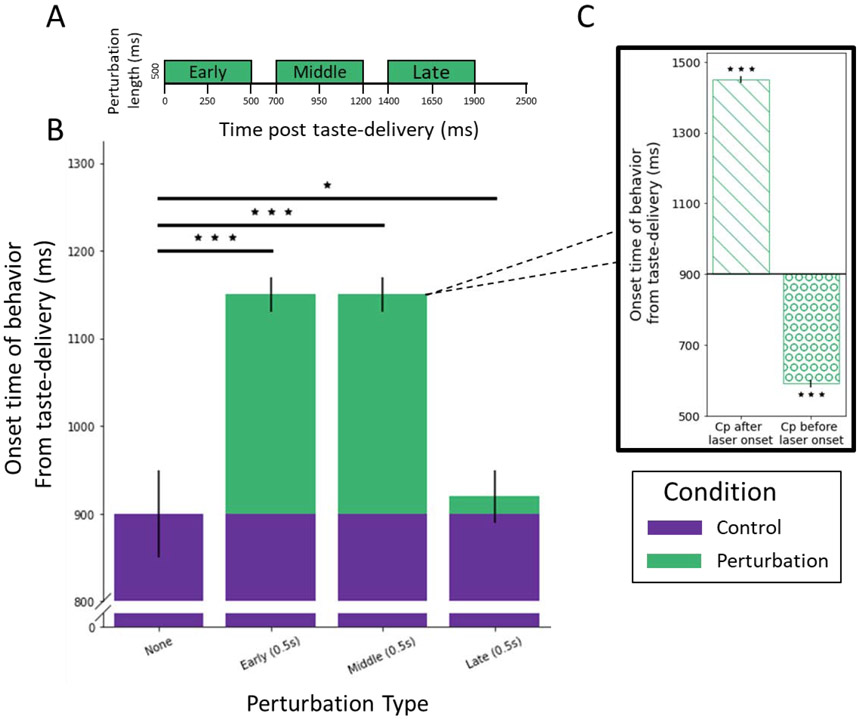

  

<b>ABSTRACT:</b>
Modern techniques that enable identification and targeted manipulation of neuron groups are frequently used to bolster theories that attribute specific behavioral functions to specific neuron types. These same techniques can also be used, however, to highlight limitations of such attribution, and to develop the argument that the question “what is the function of these neurons?” is ill-posed in the absence of temporal and network constraints. Here we do this, first reviewing evidence that neural responses are dynamic at multiple time scales, making the point that such changes in firing rates imply changes in what the neuron is doing. Studies involving brief perturbations of neural populations confirm this point, showing that the functions in which these populations participate change across seconds and even milliseconds. Based on these studies, we suggest that it is inappropriate to assign function to sets of neurons without contextualizing that assignment to specific times and network conditions.

[Download paper here](https://www.ncbi.nlm.nih.gov/pmc/articles/PMC8967145/)