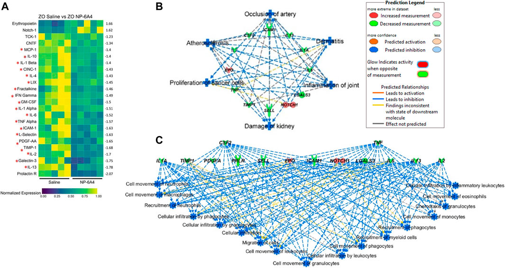

  

<b>ABSTRACT:</b>
Obesity affects over 42% of the United States population and exacerbates heart disease, the leading cause of death in men and women. Obesity also increases pro-inflammatory cytokines that cause chronic tissue damage to vital organs. The standard-of-care does not sufficiently attenuate these inflammatory sequelae. Angiotensin II receptor AT2R is an anti-inflammatory and cardiovascular protective molecule; however, AT2R agonists are not used in the clinic to treat heart disease. NP-6A4 is a new AT2R peptide agonist with an FDA orphan drug designation for pediatric cardiomyopathy. NP-6A4 increases AT2R expression (mRNA and protein) and nitric oxide generation in human cardiovascular cells. AT2R-antagonist PD123319 and AT2RSiRNA suppress NP-6A4-effects indicating that NP-6A4 acts through AT2R. To determine whether NP-6A4 would mitigate cardiac damage from chronic inflammation induced by untreated obesity, we investigated the effects of 2-weeks NP-6A4 treatment (1.8 mg/kg delivered subcutaneously) on cardiac pathology of male Zucker obese (ZO) rats that display obesity, pre-diabetes and cardiac dysfunction. NP-6A4 attenuated cardiac diastolic and systolic dysfunction, cardiac fibrosis and cardiomyocyte hypertrophy, but increased myocardial capillary density. NP-6A4 treatment suppressed tubulointerstitial injury marker urinary β-NAG, and liver injury marker alkaline phosphatase in serum. These protective effects of NP-6A4 occurred in the presence of obesity, hyperinsulinemia, hyperglycemia, and hyperlipidemia, and without modulating blood pressure. NP-6A4 increased expression of AT2R (consistent with human cells) and cardioprotective erythropoietin (EPO) and Notch1 in ZO rat heart, but suppressed nineteen inflammatory cytokines. Cardiac miRNA profiling and in silico analysis showed that NP-6A4 activated a unique miRNA network that may regulate expression of AT2R, EPO, Notch1 and inflammatory cytokines, and mitigate cardiac pathology. Seventeen pro-inflammatory and pro-fibrotic cytokines that increase during lethal cytokine storms caused by infections such as COVID-19 were among the cytokines suppressed by NP-6A4 treatment in ZO rat heart. Thus, NP-6A4 activates a novel anti-inflammatory network comprised of 21 proteins in the heart that was not reported previously. Since NP-6A4’s unique mode of action suppresses pro-inflammatory cytokine network and attenuates myocardial damage, it can be an ideal adjuvant drug with other anti-glycemic, anti-hypertensive, standard-of-care drugs to protect the heart tissues from pro-inflammatory and pro-fibrotic cytokine attack induced by obesity.

[Download paper here](https://www.frontiersin.org/articles/10.3389/fphar.2021.693167)