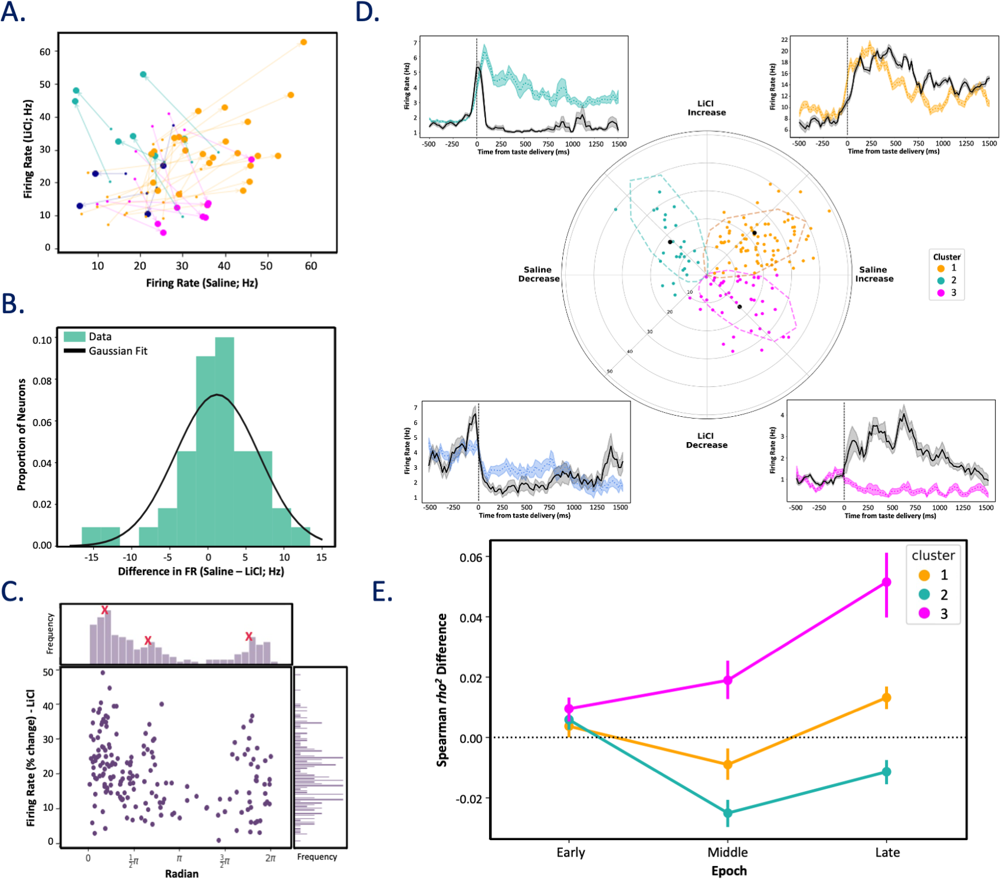

  

<b>ABSTRACT:</b>
Gustatory cortex (GC), a structure deeply involved in the making of consumption decisions, presumably performs this function by integrating information about taste, experiences, and internal states related to the animal’s health, such as illness. Here, we investigated this assertion, examining whether illness is represented in GC activity, and how this representation impacts taste responses and behavior. We recorded GC single-neuron activity and local field potentials (LFPs) from healthy rats and rats made ill (via LiCl injection). We show (consistent with the extant literature) that the onset of illness-related behaviors arises contemporaneously with alterations in 7 to 12 Hz LFP power at approximately 12 min following injection. This process was accompanied by reductions in single-neuron taste response magnitudes and discriminability, and with enhancements in palatability-relatedness—a result reflecting the collapse of responses toward a simple “good-bad” code visible in the entire sample, but focused on a specific subset of GC neurons. Overall, our data show that a state (illness) that profoundly reduces consumption changes basic properties of the sensory cortical response to tastes, in a manner that can easily explain illness’ impact on consumption.

[Download paper here](https://journals.plos.org/plosbiology/article?id=10.1371/journal.pbio.3001537)