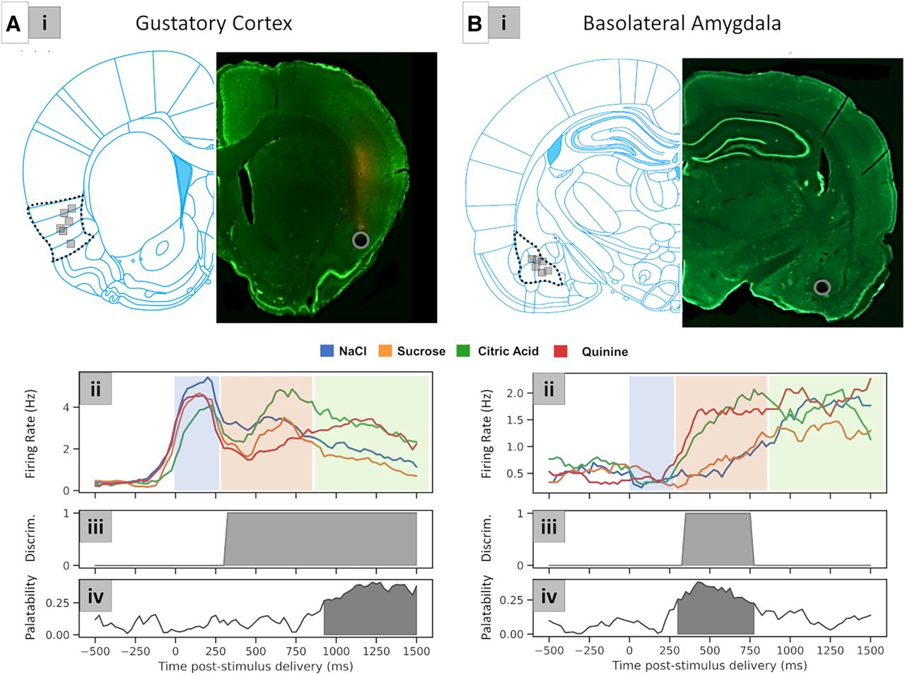

  

<b>ABSTRACT:</b>
Gustatory cortical (GC) single-neuron taste responses reflect taste quality and palatability in successive epochs. Ensemble analyses reveal epoch-to-epoch firing-rate changes in these responses to be sudden, coherent transitions. Such nonlinear dynamics suggest that GC is part of a recurrent network, producing these dynamics in concert with other structures. Basolateral amygdala (BLA), which is reciprocally connected to GC and central to hedonic processing, is a strong candidate partner for GC, in that BLA taste responses evolve on the same general clock as GC and because inhibition of activity in the BLA→GC pathway degrades the sharpness of GC transitions. These facts motivate, but do not test, our overarching hypothesis that BLA and GC act as a single, comodulated network during taste processing. Here, we provide just this test of simultaneous (BLA and GC) extracellular taste responses in female rats, probing the multiregional dynamics of activity to directly test whether BLA and GC responses contain coupled dynamics. We show that BLA and GC response magnitudes covary across trials and within single responses, and that changes in BLA–GC local field potential phase coherence are epoch specific. Such classic coherence analyses, however, obscure the most salient facet of BLA–GC coupling: sudden transitions in and out of the epoch known to be involved in driving gaping behavior happen near simultaneously in the two regions, despite huge trial-to-trial variability in transition latencies. This novel form of inter-regional coupling, which we show is easily replicated in model networks, suggests collective processing in a distributed neural network.

<b>SIGNIFICANCE STATEMENT:</b> There has been little investigation into real-time communication between brain regions during taste processing, a fact reflecting the dominant belief that taste circuitry is largely feedforward. Here, we perform an in-depth analysis of real-time interactions between GC and BLA in response to passive taste deliveries, using both conventional coherence metrics and a novel methodology that explicitly considers trial-to-trial variability and fast single-trial dynamics in evoked responses. Our results demonstrate that BLA–GC coherence changes as the taste response unfolds, and that BLA and GC specifically couple for the sudden transition into (and out of) the behaviorally relevant neural response epoch, suggesting (although not proving) that: (1) recurrent interactions subserve the function of the dyad as (2) a putative attractor network.

[Download paper here](https://www.jneurosci.org/content/43/3/386)