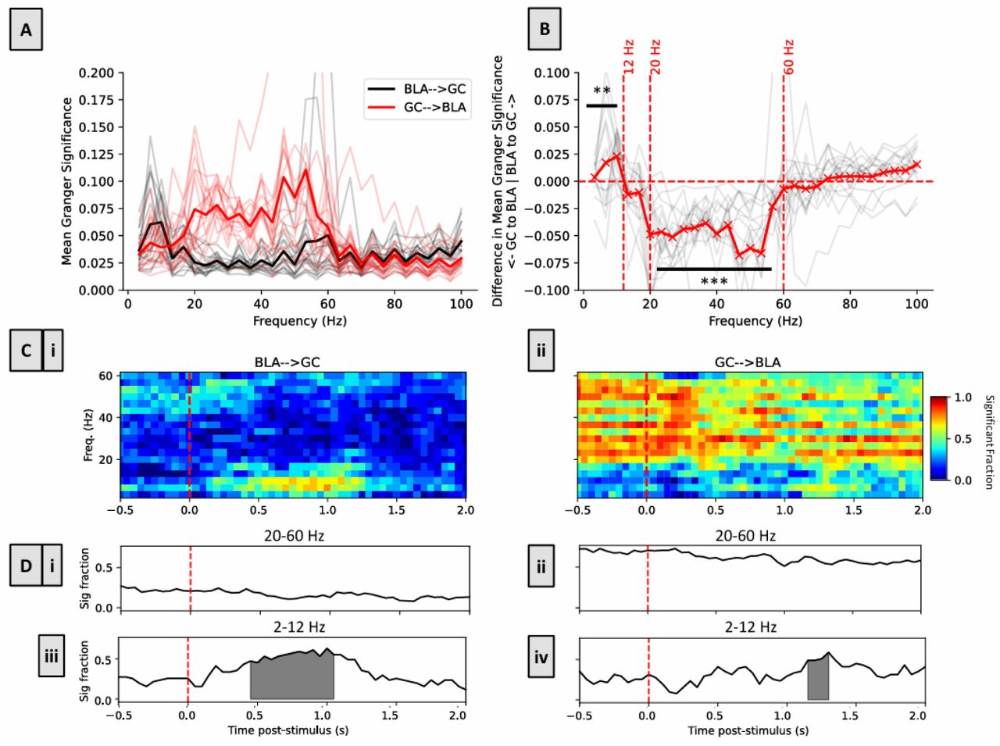

  

**PREPRINT**

Authors: A. Mahmood, J.R. Steindler, D.B. Katz

doi: https://doi.org/10.1101/2025.07.01.662567

<b>ABSTRACT:</b>
This preprint examines taste responses recorded simultaneously from gustatory cortex and basolateral amygdala in awake rats. The analyses show reciprocal, asymmetric influences between the regions, with amygdala-to-cortex interactions dominating earlier palatability-related processing and cortex-to-amygdala interactions becoming stronger later in the response. The work argues that taste processing and decision-making are properties of an amygdala-cortical loop rather than a strictly feedforward pathway.

[View preprint](https://doi.org/10.1101/2025.07.01.662567) | [Download PDF](https://www.biorxiv.org/content/10.1101/2025.07.01.662567v1.full.pdf)
