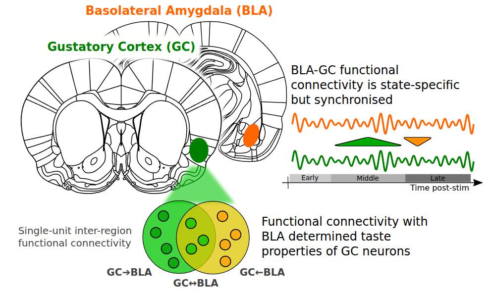

---
# Sensory and palatability coding published in Journal of Neurophysiology
# Closes #65
# Thumbnail image and excerpt for publications page
title: "Sensory and Palatability Coding of Taste Stimuli in Cortex Involves Dynamic and Asymmetric Cortico-Amygdalar Interactions"
collection: publications
permalink: /publication/2026_mahmood_interactions
excerpt: '{: width="250" }  Sensory and Palatability Coding of Taste Stimuli in Cortex Involves Dynamic and Asymmetric Cortico-Amygdalar Interactions'
date: 2026-01-01
venue: 'Journal of Neurophysiology'
paperurl: 'https://doi.org/10.1152/jn.00503.2025'
citation: 'Mahmood A, Steindler JR, Katz DB (2026) Sensory and palatability coding of taste stimuli in cortex involves dynamic and asymmetric cortico-amygdalar interactions. Journal of Neurophysiology jn.00503.2025.'
---

  

**ARTICLE**

Authors: A. Mahmood, J.R. Steindler, D.B. Katz

doi: https://doi.org/10.1152/jn.00503.2025

[Download paper here](https://doi.org/10.1152/jn.00503.2025)
