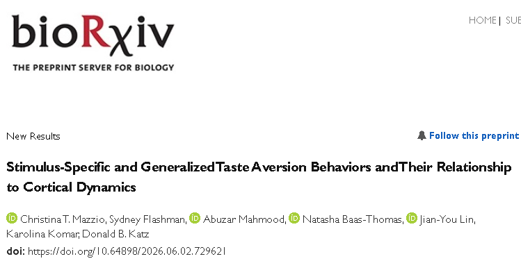

  

**PREPRINT**

Authors: Christina Teresa Mazzio, Sydney Flashman, Abuzar Mahmood, Natasha Baas-Thomas, Jian-You Lin, Karolina Komar

doi: https://doi.org/10.64898/2026.06.02.729621

<b>ABSTRACT:</b>
This preprint compares aversive taste behaviors caused by conditioned taste aversion with responses to naturally aversive quinine while recording gustatory cortical activity and jaw-opener EMG. The results identify two classes of gaping: a taste-specific class aligned with cortical taste and palatability dynamics, and a rapid generalized class linked to internal state and heightened vigilance.

[View preprint](https://doi.org/10.64898/2026.06.02.729621) | [Download PDF](https://www.biorxiv.org/content/10.64898/2026.06.02.729621v1.full.pdf)
