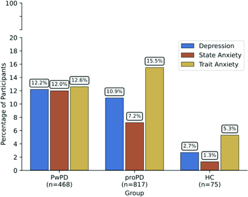

---
# Mukadam et al. published in Neuropsychology
# Closes #108
# Thumbnail image and excerpt for publications page
title: "Subjective Cognitive Concerns and Global Metacognitive Bias in Prodromal Parkinson's and Parkinson's Disease without Cognitive Impairment"
collection: publications
permalink: /publication/2026_mukadam
excerpt: '{: width="250" }  Subjective Cognitive Concerns and Global Metacognitive Bias in Prodromal Parkinson''s and Parkinson''s Disease without Cognitive Impairment'
date: 2026-04-16
venue: 'Neuropsychology'
paperurl: 'https://doi.org/10.1037/neu0001083'
citation: 'Mukadam N, Mahmood A, Cronin-Golomb A, DeGutis J (2026) Subjective cognitive concerns and global metacognitive bias in prodromal Parkinson''s and Parkinson''s disease without cognitive impairment. Neuropsychology. doi: 10.1037/neu0001083.'
---

  

**ARTICLE**

Authors: N. Mukadam, A. Mahmood, A. Cronin-Golomb, J. DeGutis

doi: https://doi.org/10.1037/neu0001083

[Download paper here](https://doi.org/10.1037/neu0001083)
