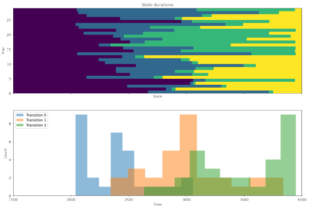

---
# pytau published in Journal of Open Source Software
title: "pytau: A Python package for streamlined changepoint model analysis in neuroscience"
collection: publications
permalink: /publication/2026_pytau
excerpt: '{: width="250" }  pytau: A Python package for streamlined changepoint model analysis in neuroscience'
date: 2026-02-11
venue: 'Journal of Open Source Software, 11(117), 8509'
paperurl: 'https://doi.org/10.21105/joss.08509'
citation: 'Mahmood A (2026) pytau: A Python package for streamlined changepoint model analysis in neuroscience. Journal of Open Source Software 11(117):8509.'
---

  

**ARTICLE**

Authors: A. Mahmood

doi: https://doi.org/10.21105/joss.08509

[Download paper here](https://doi.org/10.21105/joss.08509)
